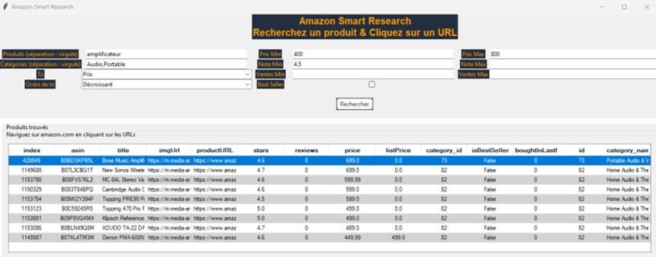

# Data analysis and product search interface of Amazon US data

### Project goal
The goal of the project was to analyze product data from Amazon US (https://www.kaggle.com/datasets/asaniczka/amazon-products-dataset-2023-1-4m-products) and then create a graphical interface that allows a user to search for products according to chosen criteria (such as price, category, rating, etc.)

### Project step
- Product data analysis
- Development of product search functions
- Creation of a search interface

### Folders and files
- Scripts/part_1_notebook.ipynb: data analysis notebook
- Scripts/part_2_main.py: filters
- Scripts/part_2_functions.py: functions used in part 2
- Scripts/part_3_main.py: search interface
- Scripts/part_3_functions.py: functions used in part 3
- Data/raw: raw data
- Data/out: data modified

### Libraries used
pandas, seaborn, tkinter, webbrowser, deep_translator
